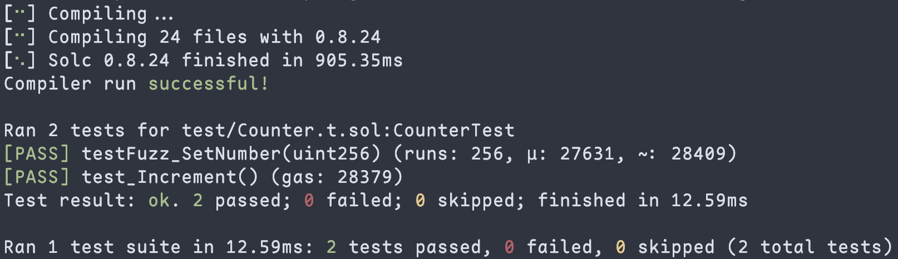
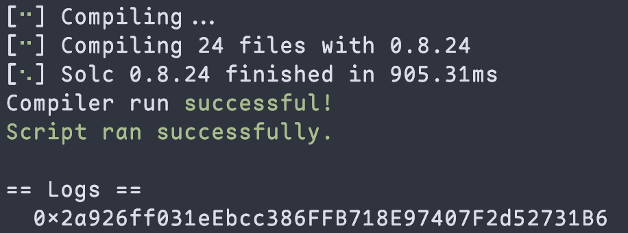
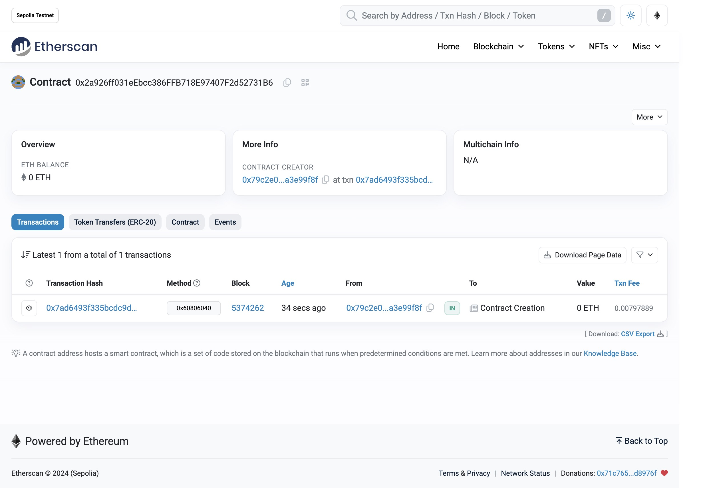

# 2024-Spring-HW0

All the detailed specified in Homework 0 documentation.

## Wallet Address

Please provide your MetaMask wallet address:

```
0x79c2e0dC121073fd240489eDc4Fb4621a3e99f8f
```

## Local Testing

Please provide a screenshot of the `forge test -vvv` command running in your local environment.


## Contract Address

Please provide the contract address that you deployed on the Sepolia network:

```
0x2a926ff031eEbcc386FFB718E97407F2d52731B6
```

## Forge Script Log



## Sepolia Etherscan

Paste the contract address into the Sepolia Etherscan and share the screenshot.

