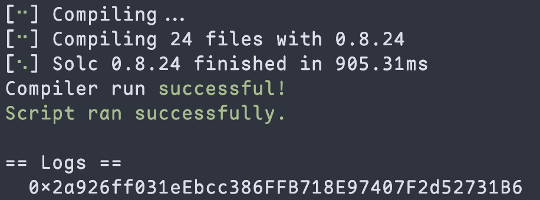

# 2024-Spring-HW0

All the detailed specified in Homework 0 documentation.

## Wallet Address
Please provide your MetaMask wallet address:

## Local Testing
Please provide a screenshot of the `forge test -vvv` command running in your local environment.

## Contract Address
<<<<<<< HEAD
Please provide the contract address that you deployed on the Sepolia network.
=======

Please provide the contract address that you deployed on the Sepolia network:

```
0x2a926ff031eEbcc386FFB718E97407F2d52731B6
```

## Forge Script Log


>>>>>>> 60ac4a9 (fix)

## Sepolia Etherscan
Paste the contract address into the Sepolia Etherscan and share the screenshot.